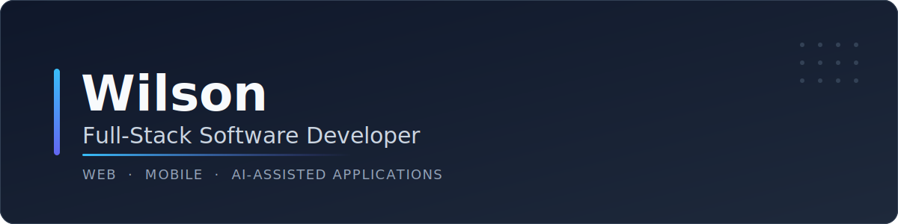
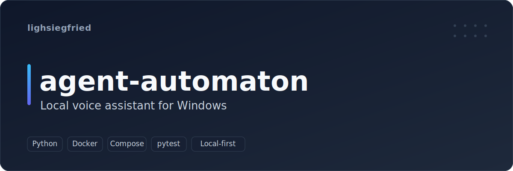
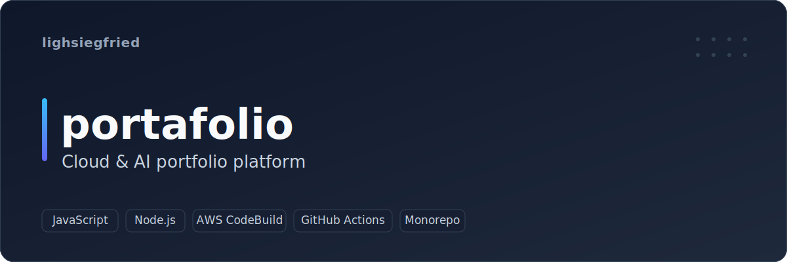
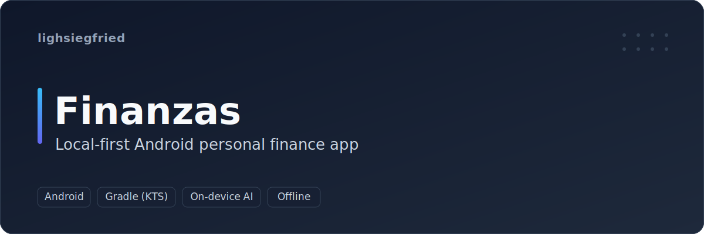
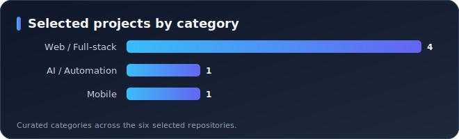
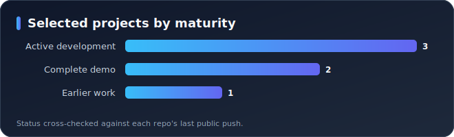
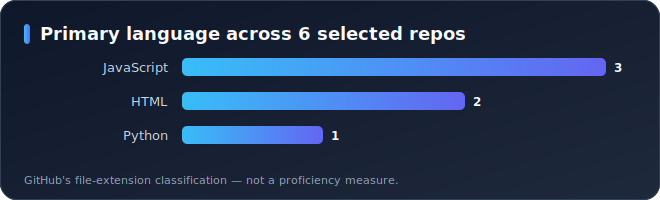

<!-- Language: English (primary) · Español → README.es.md -->

<strong>English</strong> · <a href="README.es.md">Español</a>

# Wilson

**Full-Stack Software Developer** — I build full-stack web, mobile, and
local-first AI-assisted applications.

<a href="https://github.com/lighsiegfried">GitHub profile</a> ·
<a href="#featured-projects">Featured projects</a> ·
<a href="#technical-stack">Technical stack</a>

---

## About

I build software across the stack — web front-ends, back-end services, native
Android, and local-first tools with on-device AI assistants. Recent work turns
AI and automation into practical desktop and mobile applications.

I care about shipping maintainable projects: containerized services, CI/CD
pipelines, configuration kept out of version control, and automated tests where
they matter. Representative work is in **Featured projects** below.

## Quick highlights

| | |
| --- | --- |
| **Direction** | Full-stack development — web · mobile · AI-assisted apps |
| **Core stack** | JavaScript / Node.js · Python · Android (native) |
| **Project types** | Full-stack apps · voice/automation tools · mobile · 3D web |
| **Engineering priorities** | Containerization · CI/CD · privacy by default · automated tests |

Grounded in public repositories — see the projects and stack below.

## Featured projects

Three original projects that show range across automation, cloud, and mobile.
Covers are branded project art, not screenshots.

### agent-automaton — Local voice assistant for Windows

Voice-driven assistant that recognizes spoken commands and runs desktop actions
on-device, for hands-free, private operation.

- **Stack:** Python · Docker / Compose · voice & wake-word pipelines · pytest.
- **Engineering:** containerized (`Dockerfile` + `compose.yml`); capability-scoped
  dependency sets (`requirements-voice.txt`, `requirements-wakeword.txt`, …); an
  automated `pytest` suite (`pytest.ini`, `tests/`).
- **Repository:** <https://github.com/lighsiegfried/agent-automaton>

### portafolio — Cloud & AI portfolio platform

A monorepo portfolio application with infrastructure-as-code and an AWS build
pipeline.

- **Stack:** JavaScript · Node.js · AWS (CodeBuild) · GitHub Actions.
- **Engineering:** monorepo layout (`apps/`); infrastructure-as-code (`infra/`);
  AWS CodeBuild pipelines (`buildspec.yaml`); configuration via `.env.example`;
  Node version pinned (`.nvmrc`).
- **Repository:** <https://github.com/lighsiegfried/portafolio>

### Finanzas — Local-first Android personal finance app

A native Android app that stores records fully on-device and includes a local AI
assistant, for private spending and savings tracking.

- **Stack:** Android (native) · Gradle (Kotlin DSL) · on-device AI.
- **Engineering:** fully local data storage for privacy; signing secrets kept out
  of version control (`keystore.properties.example`); Gradle Kotlin DSL build
  (`build.gradle.kts`).
- **Repository:** <https://github.com/lighsiegfried/Finanzas>

More projects — <a href="https://github.com/lighsiegfried/modelos3d">modelos3d</a> (Next.js 3D web) and <a href="https://github.com/lighsiegfried/crud_nodejs">crud_nodejs</a> (full-stack CRUD) — are on the <a href="https://github.com/lighsiegfried?tab=repositories">repositories tab</a>.

## Technical stack

Only technologies observed in public repositories. **Core** = used across
multiple projects; **project** = seen in a specific selected project.

| Area | Technologies | Level |
| --- | --- | --- |
| Frontend | JavaScript, React / Next.js, HTML, CSS, Bootstrap, jQuery | Core |
| Backend | Node.js, Python, PHP | Core |
| Mobile | Android (native), Gradle (Kotlin DSL) | Project (Finanzas) |
| Cloud & DevOps | AWS CodeBuild, Docker, Docker Compose, GitHub Actions | Project (portafolio, agent-automaton) |
| Testing | pytest | Project (agent-automaton) |
| AI & Automation | On-device AI assistants, voice-command automation | Project (agent-automaton, Finanzas) |

Databases: relational / SQL (engine varies by project). Languages seen across repos: JavaScript, Python, Java, PHP, HTML/CSS.

## Development snapshot

Generated from **public GitHub metadata** across the six selected repositories.
GitHub's language classification reflects file types, **not** proficiency.

Charts regenerate weekly from public metadata via GitHub Actions. See <a href="scripts/generate-profile-metrics.mjs">the generator</a>.

## Engineering approach

Demonstrated in the selected repositories:

- **Architecture:** monorepo with infrastructure-as-code (`portafolio`);
  containerized services (`agent-automaton`).
- **Documentation:** per-project `README.md`; configuration documented via
  `.env.example` / `keystore.properties.example`.
- **Testing:** automated `pytest` suite in `agent-automaton`.
- **CI/CD:** AWS CodeBuild buildspecs and GitHub Actions (`portafolio`).
- **Privacy by default:** local-first data and secrets kept out of version
  control (`Finanzas`, `agent-automaton`).

## Current focus

Recent public activity (2026) centers on **local-first, AI-assisted
applications** and **voice automation** — see `agent-automaton`, `Finanzas`,
and `portafolio`.

## Contact

- **GitHub:** <https://github.com/lighsiegfried>

---

<strong>English</strong> · <a href="README.es.md">Español</a>

<!--
Content rules for this profile (see CLAUDE.md):
- Nothing is fabricated. Unverified facts are omitted rather than shown as
  unfinished markers. Missing items are tracked privately in
  github-modernization-report/content-gaps.md.
- Keep README.md and README.es.md in sync (structure, links, and content).
- Additional verified contact links (LinkedIn, email, portfolio) can be added
  once provided.
-->
